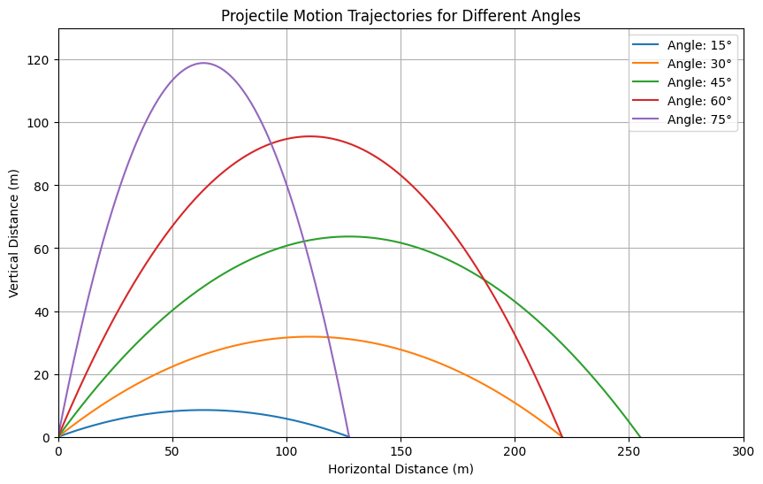
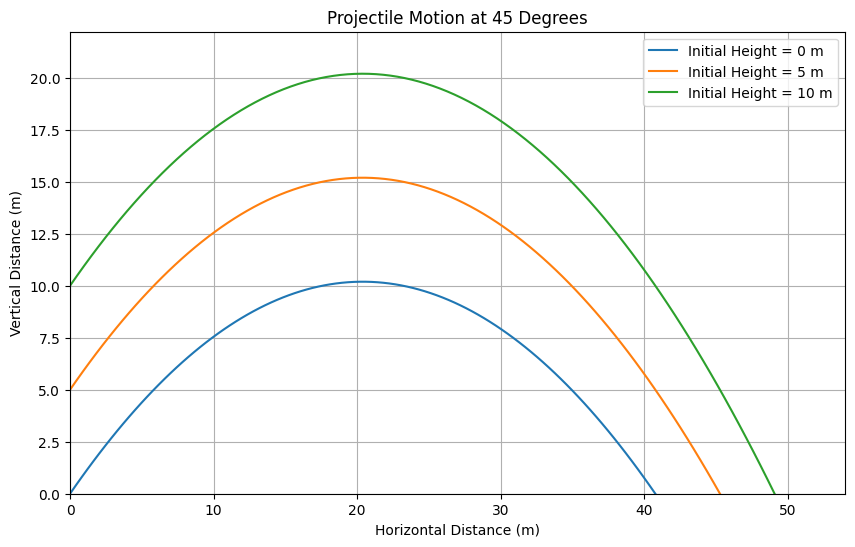
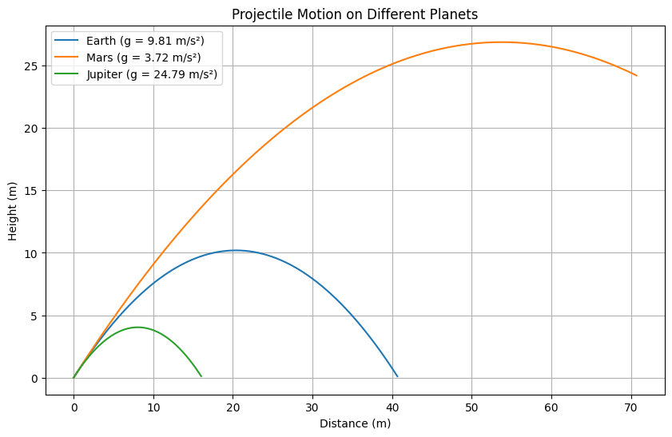

# Problem 1

## Discuss the problem of projectile motion. Investigate the dependence of the range on the angle of projection.

## Projectile Motion

Projectile motion refers to the motion of an object that is launched into the air and is influenced only by the force of gravity after its initial launch. The path followed by a projectile is a curved trajectory, typically a parabola, and is determined by its initial velocity, launch angle, and the acceleration due to gravity. Understanding the dynamics of projectile motion involves analyzing key components: the horizontal motion, the vertical motion, and the angle of projection.


## Key Concepts in Projectile Motion

1. **Initial Velocity ($v_0$)**: The speed at which the projectile is launched.
2. **Angle of Projection ($\theta$)**: The angle at which the projectile is launched relative to the horizontal.
3. **Acceleration due to Gravity ($g$)**: The constant acceleration acting downward, approximately $9.81 \, \text{m/s}^2$ near the surface of the Earth.

## Differential Equations in Projectile Motion

Projectile motion is a classic physics problem governed by Newton’s laws under gravity’s influence. We can describe it using differential equations to find the position as a function of time. Define $x(t)$ as the horizontal position and $y(t)$ as the vertical position, with an initial velocity $v_0$ at an angle $\theta$.

### Horizontal Motion
Horizontally, there’s no acceleration (ignoring air resistance). The differential equation is:

$$\frac{d^2x}{dt^2} = 0$$

Initial conditions are $x(0) = 0$ and $\frac{dx}{dt}(0) = v_0 \cos\theta$. Solving:
- First integration: $\frac{dx}{dt} = v_0 \cos\theta$
- Second integration: $x(t) = v_0 \cos\theta \cdot t$

The horizontal position $x(t)$ increases linearly with time.

### Vertical Motion
Vertically, gravity acts with acceleration $-g$, giving the equation:

$$\frac{d^2y}{dt^2} = -g$$

Initial conditions are $y(0) = 0$ and $\frac{dy}{dt}(0) = v_0 \sin\theta$. Solving:
- First integration: $\frac{dy}{dt} = v_0 \sin\theta - g t$
- Second integration: $y(t) = v_0 \sin\theta \cdot t - \frac{1}{2} g t^2$

This describes the parabolic path of $y(t)$.

### Range and Angle Dependence
The range $R$ is the horizontal distance when $y = 0$. Set $y(t) = 0$:

$$0 = v_0 \sin\theta \cdot t - \frac{1}{2} g t^2$$

Solutions are $t = 0$ and $t = \frac{2 v_0 \sin\theta}{g}$. Substituting into $x(t)$:

$$R = x\left(\frac{2 v_0 \sin\theta}{g}\right) = v_0 \cos\theta \cdot \frac{2 v_0 \sin\theta}{g} = \frac{2 v_0^2 \sin\theta \cos\theta}{g}$$

Using $2 \sin\theta \cos\theta = \sin(2\theta)$, we get:

$$R = \frac{v_0^2 \sin(2\theta)}{g}$$

The range $R$ depends on $\sin(2\theta)$, which peaks at 1 when $2\theta = 90^\circ$ (i.e., $\theta = 45^\circ$), maximizing $R$. Angles like $30^\circ$ and $60^\circ$ yield equal ranges since $\sin(60^\circ) = \sin(120^\circ)$, showing symmetry around $45^\circ$.

Thus, $45^\circ$ optimizes the range for a given $v_0$, assuming no air resistance.

## Equations of Motion

The motion can be separated into its horizontal ($x$) and vertical ($y$) components. 

- **Horizontal Motion**: 
  - The horizontal component of the initial velocity is given by:
    $$
    v_{0x} = v_0 \cos(\theta)
    $$
  - Since there is no acceleration in the horizontal direction (ignoring air resistance), the horizontal distance (range) covered during the time of flight ($T$) can be expressed as:
    $$
    R = v_{0x} \cdot T = (v_0 \cos(\theta)) \cdot T
    $$

- **Vertical Motion**: 
  - The vertical component of the initial velocity is:
    $$
    v_{0y} = v_0 \sin(\theta)
    $$
  - The vertical motion is influenced by gravity, and can be described using the kinematic equation:
    $$
    y = v_{0y} \cdot t - \frac{1}{2} g t^2
    $$
  - The time of flight ($T$) until the projectile returns to the original level ($y = 0$) can be calculated from the vertical motion equations. Solving yields:
    $$
    T = \frac{2 v_{0y}}{g} = \frac{2 v_0 \sin(\theta)}{g}
    $$

## Dependence of the Range on the Angle of Projection

Substituting $T$ back into the range equation gives us:
$$
R = (v_0 \cos(\theta)) \cdot \left(\frac{2 v_0 \sin(\theta)}{g}\right)
$$
$$
R = \frac{v_0^2 \sin(2\theta)}{g}
$$

From this equation, we see that the range ($R$) is dependent on the initial velocity $v_0$ and the sine of $2\theta$.

### Behavior of Range with Varying Projection Angles

1. **Angle of Projection**: The value of $\sin(2\theta)$ varies with $\theta$ ranging from 0 to 90 degrees:
   - $\sin(2\theta)$ is 0 when $\theta = 0^\circ$ (no range) and when $\theta = 90^\circ$ (again, no horizontal range).
   - The value of $\sin(2\theta)$ reaches its maximum when $\theta = 45^\circ$, yielding a maximum range.

2. **Optimal Angle**: The optimal angle for maximum range in a vacuum (ignoring air resistance) is 45°. This is the angle where the horizontal and vertical components of the projectile’s motion create the longest distance due to the highest combination of height and distance traveled horizontally.

3. **Range at Other Angles**: The range decreases as the angle moves away from 45°, either toward 0° (where the projectile travels straight and falls almost immediately) or toward 90° (where it goes straight up and comes straight down).

## Conclusion

In summary, projectile motion is affected by the angle of projection, with a specific relationship that defines how far a projectile will travel. The maximum horizontal range is achieved at a projection angle of 45 degrees. Understanding these principles is crucial in fields ranging from sports science to engineering and military applications.

### My collab simulation

#### My simulations include: A graph of trajectory of 6 different angles, animation of them, an animation of a 45 degree angle both applying air resistance and without applying it.

[Simulation of a Problem in Collab](https://colab.research.google.com/drive/1mY5PqweqT_qiVlbtjPHxcoOsewLnSNBb?usp=sharing)

### Projectile Motion Chart Code

To visualize the trajectory of a projectile for different angles of projection, you can use the following Python code. This code utilizes `matplotlib` and `numpy` to plot the projectile motion paths.

```python
import numpy as np
import matplotlib.pyplot as plt

# Constants
g = 9.81  # Acceleration due to gravity (m/s^2)
v0 = 50   # Initial velocity (m/s)

# Angles of projection in degrees
angles = [15, 30, 45, 60, 75]

# Create a figure
plt.figure(figsize=(10, 6))

# Calculate and plot the trajectory for each angle
for angle in angles:
    # Convert angle to radians
    theta = np.radians(angle)

    # Time of flight
    T = (2 * v0 * np.sin(theta)) / g

    # Time intervals
    t = np.linspace(0, T, num=500)

    # Equations of motion
    x = v0 * np.cos(theta) * t               # Horizontal distance
    y = v0 * np.sin(theta) * t - 0.5 * g * t**2  # Vertical distance

    # Plotting
    plt.plot(x, y, label=f'Angle: {angle}°')

# Set up the plot limits and labels
plt.title('Projectile Motion Trajectories for Different Angles')
plt.xlabel('Horizontal Distance (m)')
plt.ylabel('Vertical Distance (m)')
plt.axhline(0, color='black', lw=0.5, ls='--')  # Ground line
plt.axvline(0, color='black', lw=0.5, ls='--')  # Initial launch line
plt.grid()
plt.legend()
plt.xlim(0, 300)  # Adjust based on expected range
plt.ylim(0, 130)   # Adjust based on expected max height

# Show the plot
plt.show()
```


### Thrown projectiles form different heights.



### Projectiles thrown on different planets.



#### Code available at my collab.
