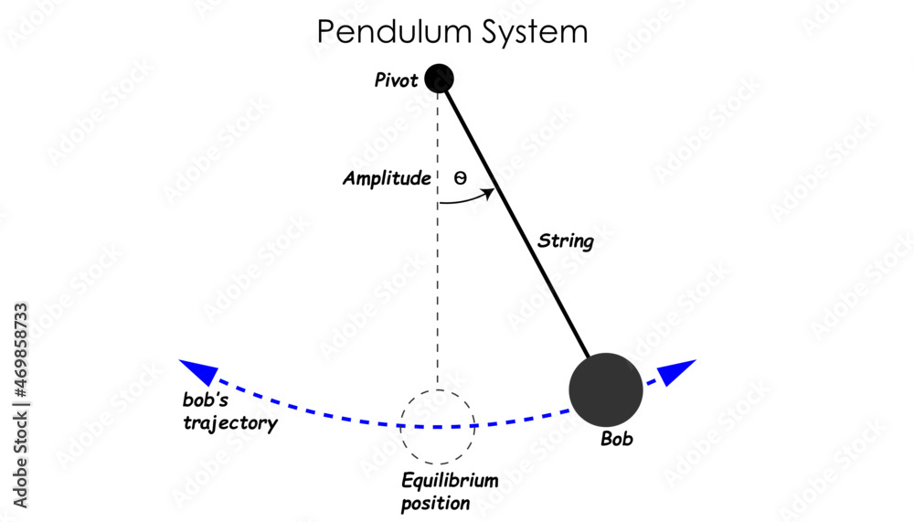

# Investigating the Dynamics of a Forced Damped Pendulum

## Introduction
A forced damped pendulum extends the classic pendulum by incorporating damping, which dissipates energy, and an external periodic force, which adds energy. This system exhibits rich behaviors like resonance and chaos, making it a compelling subject for study. Applications include mechanical oscillators, seismic instruments, and models of nonlinear dynamics. This investigation aims to explore how damping and forcing shape the pendulum's motion through theory, simulation, and potential experiments.

## Theoretical Framework
The motion of a forced damped pendulum is governed by:

$$
\frac{d^2 \theta}{dt^2} + b \frac{d \theta}{dt} + \frac{g}{L} \sin(\theta) = A \cos(\omega_f t)
$$

### Symbols and Units
- $ \theta $: Angular displacement (radians, rad)
- $ t $: Time (seconds, s)
- $ b $: Damping coefficient (per second, s⁻¹)
- $ g $: Gravitational acceleration (meters per second squared, m/s²), typically 9.81 m/s²
- $ L $: Pendulum length (meters, m)
- $ A $: Forcing amplitude (meters per second squared, m/s²)
- $ \omega_f $: Forcing frequency (radians per second, rad/s)

- **Damping Term** ($ b \frac{d \theta}{dt} $): Represents energy loss due to friction or resistance.
- **Restoring Force** ($ \frac{g}{L} \sin(\theta) $): Nonlinear, complicating the dynamics.
- **Forcing Term** ($ A \cos(\omega_f t) $): Drives the system periodically.

For small angles, $ \sin(\theta) \approx \theta $, simplifying to:

$$
\frac{d^2 \theta}{dt^2} + b \frac{d \theta}{dt} + \omega_0^2 \theta = A \cos(\omega_f t)
$$

where $ \omega_0 = \sqrt{\frac{g}{L}} $ (natural frequency, rad/s).

## Key Dynamics to Investigate
- **Steady-State Oscillations**: After transients fade, the pendulum may oscillate at $ \omega_f $, with amplitude influenced by $ b $, $ A $, and $ \omega_f / \omega_0 $.
- **Resonance**: Maximum amplitude occurs when $ \omega_f \approx \omega_0 $, moderated by damping.
- **Transients**: Initial motion depends on $ b $ and starting conditions.
- **Chaos**: Large $ A $ or specific $ \omega_f $ can trigger irregular, unpredictable motion due to nonlinearity.
- **Energy Balance**: Forcing adds energy, damping removes it; steady state reflects their equilibrium.

## Simple Pendulum
The simple pendulum is the starting point for understanding pendulum dynamics. It consists of a mass suspended from a pivot by a massless, inextensible string or rod, oscillating under gravity without damping or external forces. Its motion is described by:

$$
\frac{d^2 \theta}{dt^2} + \frac{g}{L} \sin(\theta) = 0
$$

For small angular displacements ($ \theta \ll 1 $), $ \sin(\theta) \approx \theta $, simplifying the equation to:

$$
\frac{d^2 \theta}{dt^2} + \omega_0^2 \theta = 0
$$

where $ \omega_0 = \sqrt{\frac{g}{L}} $ is the natural angular frequency. The solution is harmonic:

$$
\theta(t) = \theta_0 \cos(\omega_0 t + \phi)
$$

### Symbols and Units
- $ \theta $: Angular displacement (radians, rad)
- $ t $: Time (seconds, s)
- $ g $: Gravitational acceleration (meters per second squared, m/s²), typically 9.81 m/s²
- $ L $: Pendulum length (meters, m)
- $ \omega_0 $: Natural angular frequency (radians per second, rad/s)
- $ \theta_0 $: Initial amplitude (radians, rad)
- $ \phi $: Phase angle (radians, rad)
- $ T $: Period (seconds, s), where $ T = \frac{2\pi}{\omega_0} = 2\pi \sqrt{\frac{L}{g}} $

## Mathematical Analysis
### Linear Case (Small Angles)
For the simplified equation:

$$
\theta'' + b \theta' + \omega_0^2 \theta = A \cos(\omega_f t)
$$

- **Homogeneous Solution**: $ \theta_h(t) = e^{-\gamma t} (C_1 \cos(\omega t) + C_2 \sin(\omega t)) $, where $ \gamma = \frac{b}{2} $, $ \omega = \sqrt{\omega_0^2 - \gamma^2} $.
- **Particular Solution**: $ \theta_p(t) = D \cos(\omega_f t + \phi) $, where:
  $$
  D = \frac{A}{\sqrt{(\omega_0^2 - \omega_f^2)^2 + (b \omega_f)^2}}
  $$
  and $ \phi $ is a phase shift.

- **Resonance**: $ D $ peaks when $ \omega_f \approx \omega_0 $, reduced by larger $ b $.

### Nonlinear Case
The full equation with $ \sin(\theta) $ is nonlinear and requires numerical methods for exact solutions, though perturbation techniques can approximate behavior.

## Numerical Simulation

### Example experiment

- **Parameters**:
  - $ b $: Test 0.5 s⁻¹ (underdamped), $ 2\sqrt{\frac{g}{L}} $ (critical), 10 s⁻¹ (overdamped).
  - $ A $: Vary from 0.1 to 5 m/s².
  - $ \omega_f $: Sweep around $ \omega_0 $ (e.g., 1 to 5 rad/s).
  - Initial conditions: $ \theta_0 = \frac{\pi}{4} $ rad, $ \theta'_0 = 0 $ rad/s.
- **Plots**:
  - $ \theta(t) $ vs. $ t $: Time series for different cases.
  - $ \theta $ vs. $ \theta' $: Phase space to detect limit cycles or chaos.
  - Amplitude vs. $ \omega_f $: Resonance curve.

## Experimental Setup (If Applicable)
- **Design**: Attach a mass to a string (length $ L $), with a motor applying $ A \cos(\omega_f t) $ and a damper (e.g., vane) for $ b $.
- **Measurements**: Use a motion sensor to track $ \theta(t) $, varying $ A $ and $ \omega_f $.
- **Challenges**: Nonlinear effects at large $ \theta $, external disturbances.

## Results and Discussion
- **Findings**:
  - Damping reduces resonance amplitude and shifts steady-state behavior.
  - Large $ A $ can induce chaos, seen as irregular $ \theta(t) $.
  - Transients decay faster with higher $ b $.
- **Comparisons**: Linear theory holds for small $ \theta $; nonlinear simulation reveals chaos.
- **Insights**: Resonance depends on $ \omega_f / \omega_0 $; chaos requires strong forcing.

## Conclusion
The forced damped pendulum balances energy input and loss, exhibiting resonance, steady oscillations, or chaos depending on $ b $, $ A $, and $ \omega_f $. This has implications for engineering (e.g., vibration control) and physics (e.g., nonlinear systems). Future work could explore chaotic regimes or stochastic forcing.

[Simulation in collab](https://colab.research.google.com/drive/14HV1BIjMX1YDGW0z-BtBkJoUXG2uz6u2?usp=sharing)

