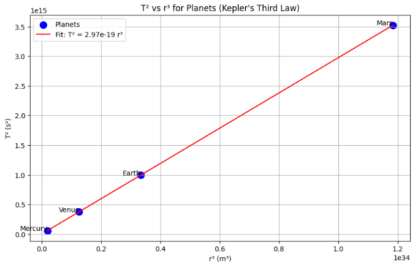

# Analysis of the Relationship Between $T^2$ and $r^3$ in Circular Motion and Its Implications for Astronomy

### Gravitational Force: Governed by Newton’s Universal Law of Gravitation:$$ F = \frac{G M m}{r^2} $$Symbols:  
$F$: Gravitational force (N)  
$G$: Gravitational constant ($m^3 kg^{-1} s^{-2}$)  
$M$: Mass of the central body (kg)  
$m$: Mass of the orbiting body (kg)  
$r$: Orbital radius (m)

### Centripetal Force: For circular motion, gravity sense as the centripetal force:$$ \frac{m v^2}{r} = \frac{G M m}{r^2} $$Symbols:  
$v$: Orbital velocity ($m s^{-1}$)  
Other symbols as defined above.

### Derivation of $T^2$ Kepler Formula

Step 1: Orbital velocity for circular motion is the circumference divided by the period:$$ v = \frac{2\pi r}{T} $$Symbols:  
$v$: Orbital velocity ($m s^{-1}$)  
$r$: Orbital radius (m)  
$T$: Orbital period (s)

Step 2: Substitute $v$ into the centripetal force equation: $$\frac{m \left(\frac{2\pi r}{T}\right)^2}{r} = \frac{G M m}{r^2}$$ Simplify: $$\frac{m \cdot 4\pi^2 r^2}{T^2 r} = \frac{G M m}{r^2}$$ $$\frac{4\pi^2 r}{T^2} = \frac{G M}{r^2}$$ Symbols:  
$m$: Mass of the orbiting body (kg)  
$G$: Gravitational constant ($m^3 kg^{-1} s^{-2}$)  
$M$: Mass of the central body (kg)  
$r$: Orbital radius (m)  
$T$: Orbital period (s)

Step 3: Rearrange: $$4\pi^2 r^3 = G M T^2$$ $$T^2 = \frac{4\pi^2}{G M} r^3$$ Thus, $T^2 \propto r^3$, which is Kepler’s Third Law for circular orbits, with constant $k = \frac{4\pi^2}{G M}$.

Symbols:  
$T$: Orbital period (s)  
$r$: Orbital radius (m)  
$G$: Gravitational constant ($m^3 kg^{-1} s^{-2}$)  
$M$: Mass of the central body (kg)  
$k$: Proportionality constant ($s^2 m^{-3}$)

Verification with Planetary Data

Planets: Mercury ($r = 0.387098$ AU, $T = 0.240846$ yr), Venus ($r = 0.723332$ AU, $T = 0.615198$ yr), Earth ($r = 1.000000$ AU, $T = 1.000000$ yr), Mars ($r = 1.523680$ AU, $T = 1.88082$ yr).

Unit Conversion:  
$1$ AU = $1.496 \times 10^{11}$ m.  
$1$ yr = $3.15576 \times 10^7$ s.

Data: Compute $T^2$ (in $s^2$) and $r^3$ (in $m^3$) for each planet to verify $T^2 \propto r^3$.

$T^2$ vs $r^3$ Plot

A plot of $T^2$ vs $r^3$ for Mercury, Venus, Earth, and Mars yields a straight line, confirming $T^2 = k r^3$.

The straight line confirms the proportionality, unlike incorrect $T^2$ vs $r$ plots.

## Calculate Mass of the Sun

Using Earth’s Orbit:  
$r = 1.496 \times 10^{11}$ m, $T = 3.15576 \times 10^7$ s.  
Formula: $$ M = \frac{4\pi^2 r^3}{G T^2} $$  
Calculation:$$ M_{\text{Sun}} = \frac{4 \pi^2 (1.496 \times 10^{11})^3}{6.67430 \times 10^{-11} (3.15576 \times 10^7)^2} \approx 1.989 \times 10^{30} , \text{kg} $$  
Result: Mass of the Sun = $1.99 \times 10^{30}$ kg.Symbols:  
$M$: Mass of the Sun (kg)  
$r$: Orbital radius (m)  
$T$: Orbital period (s)  
$G$: Gravitational constant ($m^3 kg^{-1} s^{-2}$)

## Calculate Mass of Earth

Using Geostationary Satellite:  
$r = 42,164 \times 10^3$ m, $T = 24 \times 3600 = 86,400$ s.  
Formula: $$ M = \frac{4\pi^2 r^3}{G T^2} $$  
Calculation:$$ M_{\text{Earth}} = \frac{4 \pi^2 (42,164 \times 10^3)^3}{6.67430 \times 10^{-11} (86,400)^2} \approx 5.972 \times 10^{24} , \text{kg} $$  
Result: Mass of Earth = $5.97 \times 10^{24}$ kg.

Symbols:  
$M$: Mass of the Earth (kg)  
$r$: Orbital radius (m)  
$T$: Orbital period (s)  
$G$: Gravitational constant ($m^3 kg^{-1} s^{-2}$)

## Assumptions and Limitations

Circular Orbits: Assumes circular orbits; for elliptical orbits, use semi-major axis ($a$) where $T^2 \propto a^3$.
Two-Body System: Assumes the central body’s mass dominates ($m \ll M$).
No Perturbations: Ignores external forces from other bodies or relativistic effects.

### Astronomical Implications

Mass Determination: Enables calculation of central body masses (e.g., stars, planets).
Exoplanet Detection: Infers star masses from exoplanet orbits.
Satellite Orbits: Designs specific orbits (e.g., geostationary satellites).
Galactic Dynamics: Deviations from $T^2 \propto r^3$ indicate dark matter in galaxies.
Historical Significance: Kepler’s Third Law supported the heliocentric model.

### Summary

Kepler’s Third Law ($T^2 \propto r^3$) is derived from gravitational and centripetal forces, verified by a straight-line $T^2$ vs $r^3$ plot for Mercury, Venus, Earth, and Mars.
Mass calculations yield $M_{\text{Sun}} \approx 1.99 \times 10^{30}$ kg and $M_{\text{Earth}} \approx 5.97 \times 10^{24}$ kg.
The relationship is crucial for astronomy, enabling mass measurements, orbit design, exoplanet detection, and insights into cosmic structures.

