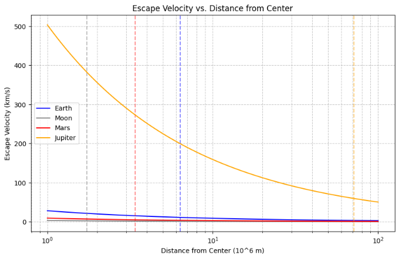
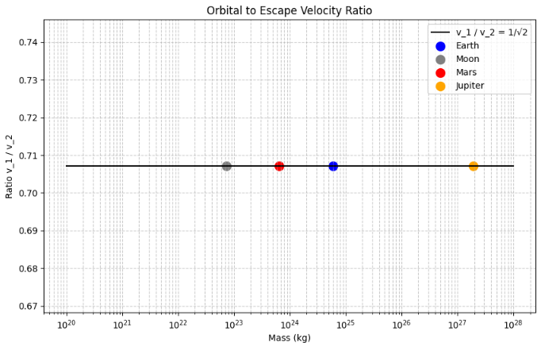
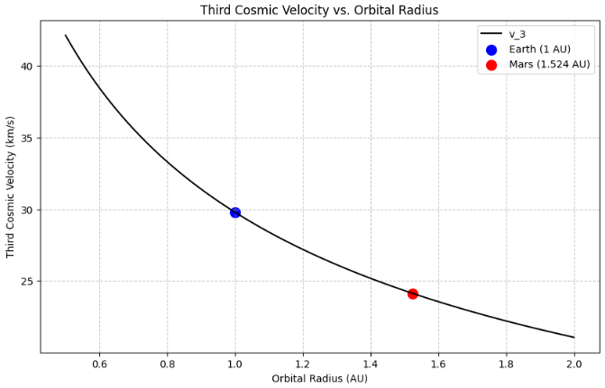
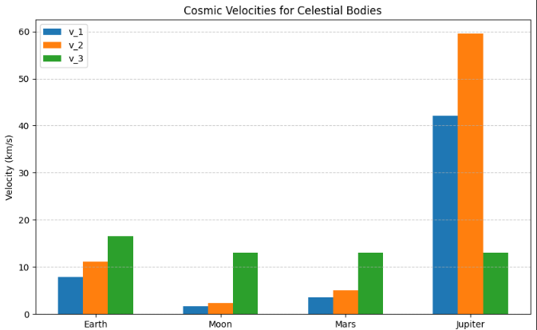
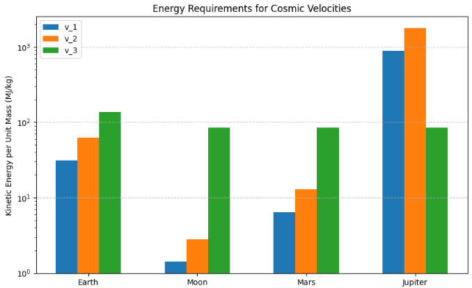

Problem 2

# Escape Velocities in Space Exploration

## Introduction
Escape velocity is a cornerstone of celestial mechanics, defining the minimum speed required for an object to overcome a celestial body's gravitational pull without further propulsion. This concept is critical for space exploration, governing the energy needed to achieve orbit, escape a planet, or depart a stellar system. The first, second, and third cosmic velocities correspond to specific thresholds for orbiting a body, escaping its gravity, and escaping a star’s gravity from a planet’s orbit, respectively. This note derives these velocities, provides their values for Earth, compares them across the Moon, Mars, and Jupiter, and discusses their significance in space exploration.

## Derivation of Escape Velocity
Escape velocity, $v_e$, is the speed at which an object’s kinetic energy equals its gravitational potential energy. For a body of mass $m$ at distance $r$ from a celestial body of mass $M$, the potential energy is:

$$ U = -\frac{G M m}{r}, $$

where $G \approx 6.674 \times 10^{-11} \, \text{m}^3 \text{kg}^{-1} \text{s}^{-2}$ is the gravitational constant. The kinetic energy is:

$$ K = \frac{1}{2} m v_e^2. $$

At escape, total mechanical energy is zero (the object reaches infinity with zero velocity):

$$ K + U = 0 \implies \frac{1}{2} m v_e^2 - \frac{G M m}{r} = 0. $$

Solving for $v_e$:

$$ v_e = \sqrt{\frac{2 G M}{r}}. $$

Symbol Definitions and Units:

 - $v_e$: Escape velocity, the speed needed to escape a celestial body’s gravity. Unit: $\text{m/s}$ (meters per second).
 - $m$: Mass of the object attempting to escape. Unit: $\text{kg}$ (kilograms).
 - $r$: Distance from the center of the celestial body to the object. Unit: $\text{m}$ (meters).
 - $M$: Mass of the celestial body. Unit: $\text{kg}$ (kilograms).
 - $G$: Gravitational constant, approximately $6.674 \times 10^{-11}$. Unit: $\text{m}^3 \text{kg}^{-1} \text{s}^{-2}$ (cubic meters per kilogram per second squared).
 - $U$: Gravitational potential energy. Unit: $\text{J}$ (joules, or $\text{kg} \cdot \text{m}^2 \text{s}^{-2}$).
 - $K$: Kinetic energy of the object. Unit: $\text{J}$ (joules, or $\text{kg} \cdot \text{m}^2 \text{s}^{-2}$).

This assumes a non-rotating body and no atmospheric drag, which affects practical applications. The escape velocity formula $v_e = \sqrt{\frac{2 G M}{r}}$ shows that $v_e$ decreases with distance $r$. The following graph illustrates this relationship for Earth, Moon, Mars, and Jupiter, with vertical lines marking their surface radii:

## First Cosmic Velocity: Orbital Velocity
### Derivation
The **first cosmic velocity**, $v_1$, is the speed required for a circular orbit just above a celestial body’s surface (radius $r \approx R$). The gravitational force provides the centripetal force for circular motion:

$$ \frac{m v_1^2}{r} = \frac{G M m}{r^2}. $$

Simplifying:

$$ v_1 = \sqrt{\frac{G M}{r}}. $$

Symbol Definitions and Units:

 - $v_1$: First cosmic velocity, the speed for a circular orbit. Unit: $\text{m/s}$ (meters per second).
 - $m$: Mass of the orbiting object. Unit: $\text{kg}$ (kilograms).
 - $r$: Radius of the circular orbit (approximately the body’s radius). Unit: $\text{m}$ (meters).
 - $M$: Mass of the celestial body. Unit: $\text{kg}$ (kilograms).
 - $G$: Gravitational constant, approximately $6.674 \times 10^{-11}$. Unit: $\text{m}^3 \text{kg}^{-1} \text{s}^{-2}$ (cubic meters per kilogram per second squared).

Since $v_e = \sqrt{\frac{2 G M}{r}}$, we have $v_1 = v_e / \sqrt{2}$, meaning $v_1$ is about 70.7% of the escape velocity. The relationship $v_1 = v_2 / \sqrt{2}$ holds for all celestial bodies, as shown in the following plot, which confirms the constant ratio across a range of masses, with points for Earth, Moon, Mars, and Jupiter:

### Value for Earth
For Earth ($M = 5.972 \times 10^{24} \, \text{kg}$, $R = 6.371 \times 10^6 \, \text{m}$):

$$ v_1 = \sqrt{\frac{(6.674 \times 10^{-11})(5.972 \times 10^{24})}{6.371 \times 10^6}} \approx 7.91 \, \text{km/s}. $$

### Importance
$v_1$ is essential for satellites in low Earth orbit (LEO), used for communication, navigation, and scientific observation. Real launches require additional velocity to counter atmospheric drag.

## Second Cosmic Velocity: Escape Velocity
### Derivation
The **second cosmic velocity**, $v_2$, is the speed to escape a celestial body’s gravitational field, equivalent to the escape velocity:

$$ v_2 = \sqrt{\frac{2 G M}{r}}. $$

This follows directly from the escape velocity derivation, where the object achieves zero total energy at infinity.

Symbol Definitions and Units
 - $v_2$: Second cosmic velocity, equivalent to the escape velocity. Unit: $\text{m/s}$ (meters per second).
 - $G$: Gravitational constant, approximately $6.674 \times 10^{-11}$. Unit: $\text{m}^3 \text{kg}^{-1} \text{s}^{-2}$ (cubic meters per kilogram per second squared).
 - $M$: Mass of the celestial body. Unit: $\text{kg}$ (kilograms).
 - $r$: Distance from the center of the celestial body (typically surface radius). Unit: $\text{m}$ (meters).

### Value for Earth
For Earth:

$$ v_2 = \sqrt{\frac{2 (6.674 \times 10^{-11})(5.972 \times 10^{24})}{6.371 \times 10^6}} \approx 11.19 \, \text{km/s}. $$

### Importance
$v_2$ enables interplanetary missions, such as those to the Moon or Mars, by allowing spacecraft to break free from Earth’s gravity.

## Third Cosmic Velocity: Escape from the Sun
### Derivation
The **third cosmic velocity**, $v_3$, is the speed required to escape the Sun’s gravitational field from Earth’s orbit. The escape velocity from the Sun at Earth’s orbital radius ($r = 1.496 \times 10^{11} \, \text{m}$, 1 AU) is:

$$ v_{\text{esc,Sun}} = \sqrt{\frac{2 G M_{\text{Sun}}}{r}}, $$

where $M_{\text{Sun}} = 1.989 \times 10^{30} \, \text{kg}$. Calculating:

$$ v_{\text{esc,Sun}} = \sqrt{\frac{2 (6.674 \times 10^{-11})(1.989 \times 10^{30})}{1.496 \times 10^{11}}} \approx 42.1 \, \text{km/s}. $$

Earth’s orbital velocity around the Sun is $v_{\text{orb}} \approx 29.78 \, \text{km/s}$. The velocity increment needed to escape the Sun, relative to Earth’s motion, is:

$$ \Delta v = v_{\text{esc,Sun}} - v_{\text{orb}} \approx 42.1 - 29.78 \approx 12.3 \, \text{km/s}. $$

However, launching from Earth’s surface requires first escaping Earth’s gravity ($v_2$). The total velocity, combining Earth escape and Sun escape, is approximated as:

$$ v_3 \approx \sqrt{v_2^2 + \Delta v^2} \approx \sqrt{(11.19)^2 + (12.3)^2} \approx 16.6 \, \text{km/s}. $$

This assumes a direct escape trajectory; gravitational assists or optimized orbits can reduce this requirement.

Symbol Definitions and Units:

 - $v_3$: Third cosmic velocity, the speed to escape the Sun’s gravity from Earth’s orbit. Unit: $\text{m/s}$ (meters per second).
 - $v_{\text{esc,Sun}}$: Escape velocity from the Sun at Earth’s orbital radius. Unit: $\text{m/s}$ (meters per second).
 - $G$: Gravitational constant, approximately $6.674 \times 10^{-11}$. Unit: $\text{m}^3 \text{kg}^{-1} \text{s}^{-2}$ (cubic meters per kilogram per second squared).
 - $M_{\text{Sun}}$: Mass of the Sun. Unit: $\text{kg}$ (kilograms).
 - $r$: Orbital radius from the Sun (Earth’s orbit, 1 AU). Unit: $\text{m}$ (meters).
 - $v_{\text{orb}}$: Earth’s orbital velocity around the Sun. Unit: $\text{m/s}$ (meters per second).
 - $\Delta v$: Velocity increment to escape the Sun from Earth’s orbit. Unit: $\text{m/s}$ (meters per second).
 - $v_2$: Second cosmic velocity for Earth. Unit: $\text{m/s}$ (meters per second).

The third cosmic velocity depends on the orbital radius from the Sun, as shown in the following plot, which highlights $v_3$ for Earth (1 AU) and Mars (1.524 AU):

### Value for Earth
For Earth, $v_3 \approx 16.6 \, \text{km/s}$ from the surface, or $12.3 \, \text{km/s}$ from low Earth orbit.

### Importance
$v_3$ is critical for interstellar missions, enabling probes like Voyager to leave the solar system.

## Comparison with Moon, Mars, and Jupiter
The cosmic velocities depend on a body’s mass and radius. Below is a comparison for Earth, Moon, Mars, and Jupiter, calculated using their respective masses and radii.

| **Body**   | **Mass ($M$, kg)** | **Radius ($R$, m)** | **$v_1$ (km/s)** | **$v_2$ (km/s)** | **$v_3$ (km/s)** |
|------------|--------------------|---------------------|------------------|------------------|------------------|
| **Earth**  | $5.972 \times 10^{24}$ | $6.371 \times 10^6$ | 7.91            | 11 Redacted | 16 Secondary | 16.6 (from surface) |
| **Moon**  | $7.347 \times 10^{22}$ | $1.737 \times 10^6$ | 1.68            | 2.37            | ~13 (from LEO) |
| **Mars**  | $6.417 \times 10^{23}$ | $3.397 \times 10^6$ | 3.58            | 5.07            | ~13 (from LEO) |
| **Jupiter** | $1.898 \times 10^{27}$ | $7.149 \times 10^7$ | 42.1            | 59.5            | ~13 (from orbit) |

 The table above summarizes the cosmic velocities, highlighting the influence of mass and radius. The following bar chart visually compares these velocities across the celestial bodies:

### Analysis
- **Moon**: Lower mass and radius yield $v_1 \approx 1.68 \, \text{km/s}$ and $v_2 \approx 2.37 \, \text{km/s}$, making it easier to launch from than Earth. The Apollo missions exploited this for lunar landings.
- **Mars**: With $v_1 \approx 3.58 \, \text{km/s}$ and $v_2 \approx 5.07 \, \text{km/s}$, Mars requires less energy to escape than Earth, aiding missions like Perseverance.
- **Jupiter**: High mass results in $v_1 \approx 42.1 \, \text{km/s}$ and $v_2 \approx 59.5 \, \text{km/s}$, making direct escape impractical. Probes like Juno use gravitational assists.
- **$v_3$ Consistency**: The third cosmic velocity is similar (~13 km/s from orbit) across bodies, as it depends on the Sun’s gravity at 1 AU, though surface-to-escape requirements vary.

## Practical Considerations

Achieving cosmic velocities requires significant energy, as shown in the following chart, which compares the kinetic energy per unit mass for $v_1$, $v_2$, and $v_3$ across Earth, Moon, Mars, and Jupiter:

- **Atmospheric Drag**: Earth and Mars launches face drag, increasing energy needs.
- **Multistage Rockets**: Tsiolkovsky’s equation, $\Delta v = v_e \ln(m_0/m_f)$, governs rocket design.
- **Gravitational Assists**: Used to reduce $v_3$ requirements for missions like Voyager.
- **Orbital Mechanics**: Optimized trajectories (e.g., Hohmann transfers) minimize energy.

## Significance in Space Exploration
- **First Cosmic Velocity**: Enables LEO satellites for communication and observation.
- **Second Cosmic Velocity**: Supports interplanetary travel (e.g., Apollo, Mars rovers).
- **Third Cosmic Velocity**: Facilitates interstellar probes, advancing humanity’s reach.

## Conclusion
The first, second, and third cosmic velocities—derived from gravitational and orbital mechanics—are—underpin space mission design. Earth’s values ($v_1 \approx 7.91 \, \text{km/s}$, $v_2 \approx 11.19 \, \text{km/s}$, $v_3 \approx 16.6 \, \text{km/s}$) contrast with the Moon, Mars, and Jupiter, reflecting mass and radius effects. These velocities drive innovations in propulsion and trajectory optimization, enabling humanity’s exploration from Earth orbit to interstellar space.

