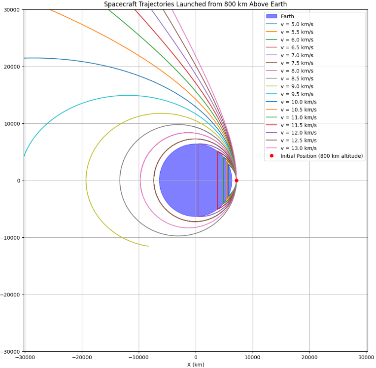

## Problem 3

## The Gravitational Slingshot

The gravitational slingshot, also known as a gravity assist maneuver, is a fundamental technique in astrodynamics that leverages the gravitational field of a celestial body to alter a spacecraft's trajectory and velocity. This method allows spacecraft to achieve significant energy changes without expending additional propellant, making it a cornerstone of interplanetary mission design. This note provides a detailed, academically rigorous analysis of the gravitational slingshot, including its physical principles, mathematical formulation, and practical applications in space exploration.

### Physical Principles of the Gravitational Slingshot

The gravitational slingshot exploits the conservation of momentum and energy within a two-body gravitational interaction between a spacecraft and a celestial body, typically a planet or moon. The key idea is that a spacecraft can "borrow" energy from the orbital motion of a planet relative to the Sun, effectively gaining or losing velocity depending on the encounter geometry.

### Momentum Exchange

Consider a spacecraft approaching a planet with a velocity $\mathbf{v}_\infty^{\text{in}}$ relative to the planet's center of mass. The planet, moving with velocity $\mathbf{V}p$ relative to the Sun, exerts a gravitational force on the spacecraft, causing it to follow a hyperbolic trajectory around the planet. During this encounter, the spacecraft's velocity relative to the planet is deflected, but its speed relative to the planet remains unchanged due to the conservation of energy in the two-body system. However, when viewed in the heliocentric (Sun-centered) frame, the spacecraft's velocity $\mathbf{v}\text{sc}$ changes because it inherits a component of the planet's orbital velocity.

The change in the spacecraft's heliocentric velocity, $\Delta \mathbf{v}$, results from the vector addition of the planet's velocity and the deflected velocity relative to the planet: $[ \mathbf{v}\text{sc}^{\text{out}} = \mathbf{v}\infty^{\text{out}} + \mathbf{V}p, ]$ where $\mathbf{v}\infty^{\text{out}}$ is the spacecraft's outgoing velocity relative to the planet. The magnitude and direction of $\Delta \mathbf{v}$ depend on the encounter geometry, particularly the impact parameter and the angle of deflection.

### Symbols and Units

$\mathbf{v}\infty^{\text{in}}$, $\mathbf{v}\infty^{\text{out}}$: Incoming and outgoing velocity of the spacecraft relative to the planet (vector), measured in $\text{km/s}$.

$\mathbf{V}_p$: Orbital velocity of the planet relative to the Sun (vector), measured in $\text{km/s}$.

$\mathbf{v}_\text{sc}^{\text{out}}$: Outgoing heliocentric velocity of the spacecraft (vector), measured in $\text{km/s}$.

$\Delta \mathbf{v}$: Change in spacecraft's heliocentric velocity (vector), measured in $\text{km/s}$.

## Energy Considerations

In the planet's reference frame, the spacecraft's kinetic energy is conserved because the gravitational interaction is elastic. The specific energy of the spacecraft relative to the planet is given by: $[ \epsilon = \frac{|\mathbf{v}\infty|^2}{2} - \frac{\mu}{r}, ]$ where $\mu = GM$ is the gravitational parameter of the planet. For a hyperbolic trajectory, $\epsilon > 0$, and the speed at infinity is $|\mathbf{v}\infty| = \sqrt{2\epsilon}$. Since $|\mathbf{v}\infty^{\text{in}}| = |\mathbf{v}\infty^{\text{out}}|$, the spacecraft's speed relative to the planet remains constant, but its direction changes.

In the heliocentric frame, the spacecraft's total energy changes due to the planet's motion. The heliocentric specific energy is: $[ E = \frac{|\mathbf{v}\text{sc}|^2}{2} - \frac{\mu\odot}{r_\odot}, ]$ where $\mu_\odot$ is the Sun's gravitational parameter, and $r_\odot$ is the distance from the Sun. A well-designed gravity assist can increase $E$, allowing the spacecraft to reach higher orbits or escape the solar system.

### Symbols and Units:

$\epsilon$: Specific energy of the spacecraft relative to the planet, measured in $\text{km}^2/\text{s}^2$.

$|\mathbf{v}_\infty|$: Magnitude of the hyperbolic excess velocity, measured in $\text{km/s}$.

$\mu$: Gravitational parameter of the planet ($GM$), measured in $\text{km}^3/\text{s}^2$.

$G$: Gravitational constant, approximately $6.67430 \times 10^{-20} , \text{km}^3 \text{kg}^{-1} \text{s}^{-2}$.

$M$: Mass of the planet, measured in $\text{kg}$.

$r$: Radial distance from the planet, measured in $\text{km}$.

$E$: Heliocentric specific energy of the spacecraft, measured in $\text{km}^2/\text{s}^2$.

$|\mathbf{v}_\text{sc}|$: Magnitude of the spacecraft's heliocentric velocity, measured in $\text{km/s}$.

$\mu_\odot$: Gravitational parameter of the Sun, measured in $\text{km}^3/\text{s}^2$.

$r_\odot$: Distance from the Sun, measured in $\text{km}$.

## Mathematical Formulation

To quantify the gravitational slingshot, we model the encounter as a hyperbolic trajectory in the planet's frame. The key parameters are the impact parameter ($b$), periapsis distance ($r_p$), and deflection angle ($\theta$).

The hyperbolic excess velocity $\mathbf{v}\infty$ defines the trajectory. The semi-major axis $a$ of the hyperbolic orbit is: $[ a = -\frac{\mu}{|\mathbf{v}\infty|^2}. ]$ The eccentricity $e$ is determined by the impact parameter: $[ e = \sqrt{1 + \left(\frac{b |\mathbf{v}_\infty|^2}{\mu}\right)^2}. ]$ The periapsis distance is: $[ r_p = a (e - 1). ]$ The deflection angle $\theta$ is related to the eccentricity: $[ \sin\left(\frac{\theta}{2}\right) = \frac{1}{e}. ]$ The maximum velocity change in the heliocentric frame occurs when the spacecraft exits the encounter parallel to the planet's velocity vector. The maximum $\Delta v$ is approximately: $[ \Delta v \approx 2 |\mathbf{V}_p| \sin\left(\frac{\theta}{2}\right). ]$

### Symbols and Units

$b$: Impact parameter, measured in $\text{km}$.

$r_p$: Periapsis distance (closest approach), measured in $\text{km}$.

$\theta$: Deflection angle, measured in radians.

$a$: Semi-major axis of the hyperbolic orbit, measured in $\text{km}$.

$e$: Eccentricity of the hyperbolic orbit (dimensionless).

$\Delta v$: Magnitude of the velocity change in the heliocentric frame, measured in $\text{km/s}$.

$|\mathbf{V}_p|$: Magnitude of the planet's orbital velocity, measured in $\text{km/s}$.

## Practical Applications in Interplanetary Missions

The gravitational slingshot is a critical technique for interplanetary missions, enabling spacecraft to reach distant destinations with limited propellant. Below, we discuss its applications, illustrated with examples.

### 1. Energy Gain for Outer Solar System Missions

Gravity assists are used to increase a spacecraft's heliocentric energy, allowing it to reach the outer planets or beyond. Examples include:

Voyager 2: Used gravity assists from Jupiter, Saturn, Uranus, and Neptune to achieve a $\Delta v$ of approximately $10 , \text{km/s}$ at Jupiter.

New Horizons: A Jupiter gravity assist in 2007 boosted its speed by about $4 , \text{km/s}$.

### 2. Trajectory Shaping

Gravity assists adjust a spacecraft's trajectory to align with mission objectives. For example:

Cassini: Used Venus-Venus-Earth-Jupiter flybys to reach Saturn.

MESSENGER: Used Earth, Venus, and Mercury flybys to enter Mercury's orbit.

### 3. Fuel Efficiency

Gravity assists reduce the need for large chemical rockets, lowering costs and increasing payload capacity.

### 4. Exploration Beyond the Solar System

Voyager 1 and 2 achieved hyperbolic orbits to explore interstellar space.

### Here is vizualization of space trajectories:

## Conclusion

The gravitational slingshot is a cornerstone of space exploration, enabling efficient interplanetary missions. Its mathematical framework, rooted in two-body dynamics, supports precise mission design. Applications from Voyager to New Horizons highlight its transformative impact.