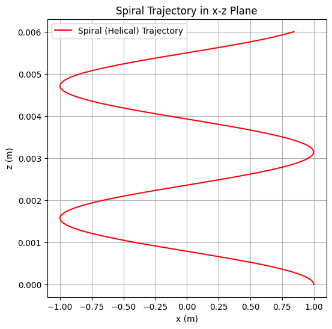
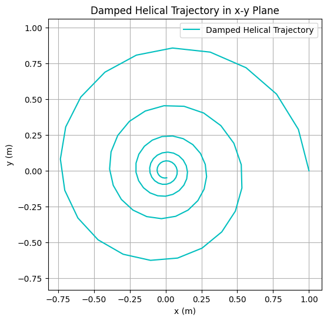
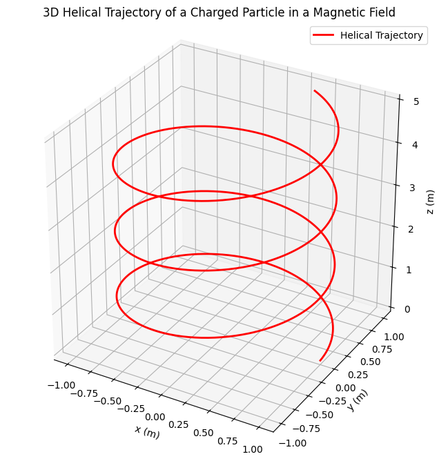
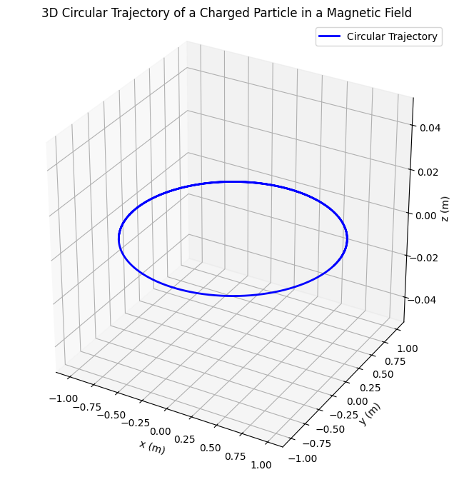
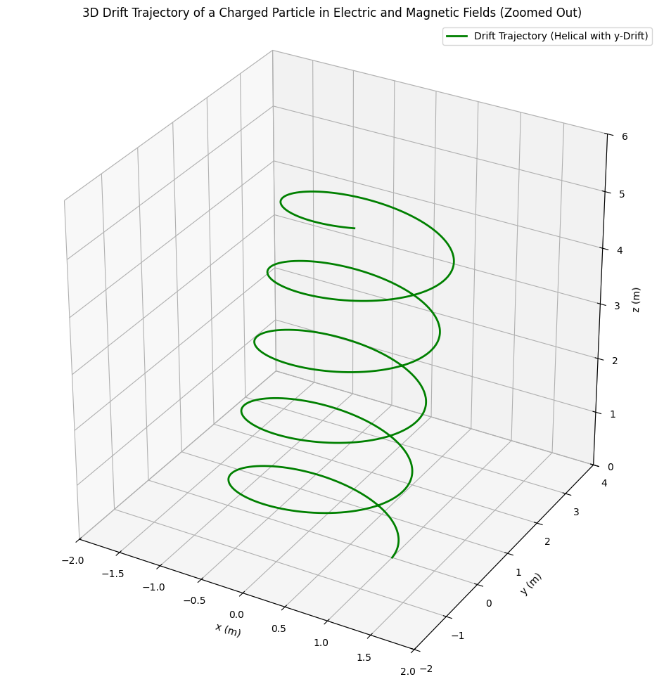
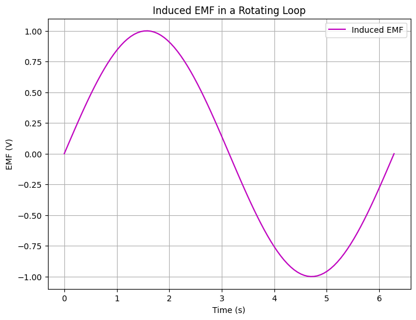

# Problem 1

## 1. Electric Field and the Principle of Superposition

The electric field $\mathbf{E}$ at a point in space is defined as the force $\mathbf{F}$ per unit charge $q$ experienced by a positive test charge placed at that point: $$ \mathbf{E} = \frac{\mathbf{F}}{q} $$ The electric field due to a point charge $Q$ at a distance $r$ is given by Coulomb’s law: $$ \mathbf{E} = \frac{k Q}{r^2} \hat{\mathbf{r}} $$ where $k$ is Coulomb’s constant ($k \approx 8.99 \times 10^9 , \text{N·m}^2/\text{C}^2$), and $\hat{\mathbf{r}}$ is the unit vector pointing from the charge to the observation point.

### Principle of Superposition

The principle of superposition states that the total electric field at a point due to multiple charges is the vector sum of the individual electric fields produced by each charge. Mathematically, for $n$ point charges $q_i$ at positions $\mathbf{r}i$, the total electric field at point $\mathbf{r}$ is: $$ \mathbf{E}{\text{total}}(\mathbf{r}) = \sum_{i=1}^n \mathbf{E}i(\mathbf{r}) = \sum{i=1}^n \frac{k q_i}{|\mathbf{r} - \mathbf{r}i|^2} \hat{\mathbf{r}}{i} $$ where $\hat{\mathbf{r}}_{i}$ is the unit vector from the $i$-th charge to the point $\mathbf{r}$.

Example: Two Point Charges

Consider two point charges: $q_1 = +2 , \mu\text{C}$ at $(0, 0)$ and $q_2 = -3 , \mu\text{C}$ at $(d, 0)$, with $d = 1 , \text{m}$. Calculate the electric field at point $P = (0.5, 0)$.

Electric field due to $q_1$ at $P$: Distance $r_1 = 0.5 , \text{m}$, so: $$ E_1 = \frac{k q_1}{r_1^2} = \frac{(8.99 \times 10^9)(2 \times 10^{-6})}{(0.5)^2} = 7.192 \times 10^4 , \text{N/C} $$ Directed along the positive $x$-axis: $\mathbf{E}_1 = (7.192 \times 10^4, 0)$.

Electric field due to $q_2$ at $P$: Distance $r_2 = 0.5 , \text{m}$, so: $$ E_2 = \frac{k |q_2|}{r_2^2} = \frac{(8.99 \times 10^9)(3 \times 10^{-6})}{(0.5)^2} = 1.079 \times 10^5 , \text{N/C} $$ Since $q_2$ is negative, the field points toward $q_2$ (negative $x$-direction): $\mathbf{E}_2 = (-1.079 \times 10^5, 0)$.

Total electric field: $$ \mathbf{E}_{\text{total}} = \mathbf{E}_1 + \mathbf{E}_2 = (7.192 \times 10^4 - 1.079 \times 10^5, 0) = (-3.598 \times 10^4, 0) , \text{N/C} $$ The net field points in the negative $x$-direction with magnitude $3.598 \times 10^4 , \text{N/C}$.

### Symbols and Units

$\mathbf{E}$: Electric field, units: $\text{N/C}$ (newtons per coulomb)

$\mathbf{F}$: Force, units: $\text{N}$ (newtons)

$q$, $q_i$, $Q$: Electric charge, units: $\text{C}$ (coulombs)

$k$: Coulomb’s constant, units: $\text{N·m}^2/\text{C}^2$

$r$, $r_1$, $r_2$, $|\mathbf{r} - \mathbf{r}_i|$: Distance, units: $\text{m}$ (meters)

$\hat{\mathbf{r}}$, $\hat{\mathbf{r}}_{i}$: Unit vector, dimensionless

$\mathbf{r}$, $\mathbf{r}_i$: Position vector, units: $\text{m}$ (meters)

## 2. Electric Potential and Electric Field Relationship

The electric potential $V$ at a point is the work done per unit charge to bring a positive test charge from infinity to that point: $$ V = -\int_{\infty}^{\mathbf{r}} \mathbf{E} \cdot d\mathbf{l} $$ For a point charge $q$ at distance $r$, the potential is: $$ V = \frac{k q}{r} $$

Electric Field as the Gradient of Potential

The electric field is the negative gradient of the electric potential: $$ \mathbf{E} = -\nabla V $$ In Cartesian coordinates, this is: $$ \mathbf{E} = -\left( \frac{\partial V}{\partial x} \hat{\mathbf{i}} + \frac{\partial V}{\partial y} \hat{\mathbf{j}} + \frac{\partial V}{\partial z} \hat{\mathbf{k}} \right) $$

### Derivation

Consider the potential due to a point charge $q$ at the origin, $V = \frac{k q}{r}$, where $r = \sqrt{x^2 + y^2 + z^2}$. The gradient is: $$ \nabla V = \frac{\partial V}{\partial x} \hat{\mathbf{i}} + \frac{\partial V}{\partial y} \hat{\mathbf{j}} + \frac{\partial V}{\partial z} \hat{\mathbf{k}} $$ Compute the partial derivative: $$ \frac{\partial V}{\partial x} = \frac{\partial}{\partial x} \left( \frac{k q}{(x^2 + y^2 + z^2)^{1/2}} \right) = -\frac{k q x}{(x^2 + y^2 + z^2)^{3/2}} $$ Similarly for $y$ and $z$. Thus: $$ \nabla V = -\frac{k q \mathbf{r}}{r^3} $$ So: $$ \mathbf{E} = -\nabla V = \frac{k q \mathbf{r}}{r^3} = \frac{k q}{r^2} \hat{\mathbf{r}} $$ This matches the expression for the electric field of a point charge.

### Physical Implications

The negative sign indicates that the electric field points in the direction of decreasing potential, reflecting the force on a positive charge.

Equipotential surfaces are perpendicular to electric field lines.

This relationship simplifies calculations in systems with high symmetry, as scalar potentials are often easier to compute than vector fields.

### Symbols and Units

$V$: Electric potential, units: $\text{V}$ (volts)

$\mathbf{E}$: Electric field, units: $\text{N/C}$ or $\text{V/m}$ (volts per meter)

$d\mathbf{l}$: Differential displacement, units: $\text{m}$ (meters)

$q$: Electric charge, units: $\text{C}$ (coulombs)

$k$: Coulomb’s constant, units: $\text{N·m}^2/\text{C}^2$

$r$: Distance, units: $\text{m}$ (meters)

$\mathbf{r}$: Position vector, units: $\text{m}$ (meters)

$x$, $y$, $z$: Cartesian coordinates, units: $\text{m}$ (meters)

$\hat{\mathbf{i}}$, $\hat{\mathbf{j}}$, $\hat{\mathbf{k}}$: Unit vectors, dimensionless

## 3. Lorentz Force

The Lorentz force acts on a charged particle with charge $q$ moving with velocity $\mathbf{v}$ in electric and magnetic fields $\mathbf{E}$ and $\mathbf{B}$: $$ \mathbf{F} = q \mathbf{E} + q \mathbf{v} \times \mathbf{B} $$

The electric force $q \mathbf{E}$ is independent of the particle’s velocity.

The magnetic force $q \mathbf{v} \times \mathbf{B}$ is perpendicular to both $\mathbf{v}$ and $\mathbf{B}$ and vanishes if $\mathbf{v} = 0$ or $\mathbf{v} \parallel \mathbf{B}$.

### Applications

Cyclotrons: A charged particle moves in a circular path in a uniform magnetic field due to the magnetic component of the Lorentz force. The radius of the path is: $$ r = \frac{m v}{|q| B} $$ Cyclotrons use this to accelerate particles for research.

Mass Spectrometers: The Lorentz force separates ions by mass-to-charge ratio. Ions follow curved paths in a magnetic field, with the radius depending on $m/q$, allowing identification of particles.

### Trajectory Visualizations

Below are Python plots depicting three trajectories of a charged particle with charge $q = 1 , \text{C}$ and mass $m = 0.001 , \text{kg}$ in a uniform magnetic field $\mathbf{B} = (0, 0, 1) , \text{T}$, with no electric field ($\mathbf{E} = 0$). The equations of motion are derived from: $$ m \frac{d\mathbf{v}}{dt} = q \mathbf{v} \times \mathbf{B} $$ The cyclotron frequency is: $$ \omega = \frac{|q| B}{m} = \frac{1 \cdot 1}{0.001} = 1000 , \text{rad/s} $$ The radius is: $$ r = \frac{m v}{|q| B} = \frac{0.001 v}{1 \cdot 1} = 0.001 v $$ To achieve a radius $r \approx 1 , \text{m}$, we set the initial velocity magnitude appropriately (e.g., $v = 1000 , \text{m/s}$).

#### Spiral Trajectory

For initial velocity $\mathbf{v}_0 = (1000, 0, 0)$, the radius is $r = 0.001 \cdot 1000 = 1 , \text{m}$, and the trajectory is a circle in the $x$-$y$ plane: $$ x(t) = r \cos(\omega t), \quad y(t) = r \sin(\omega t), \quad z(t) = 0 $$

#### Interesting Trajectory (Damped Helix)
With a damping force (e.g., resistive medium), the trajectory is:
<math xmlns="http://www.w3.org/1998/Math/MathML" display="block"><semantics><mrow><mi>x</mi><mo stretchy="false">(</mo><mi>t</mi><mo stretchy="false">)</mo><mo>=</mo><mi>r</mi><msup><mi>e</mi><mrow><mo>−</mo><mi>γ</mi><mi>t</mi></mrow></msup><mi>cos</mi><mo>⁡</mo><mo stretchy="false">(</mo><mi>ω</mi><mi>t</mi><mo stretchy="false">)</mo><mo separator="true">,</mo><mspace width="1em"></mspace><mi>y</mi><mo stretchy="false">(</mo><mi>t</mi><mo stretchy="false">)</mo><mo>=</mo><mi>r</mi><msup><mi>e</mi><mrow><mo>−</mo><mi>γ</mi><mi>t</mi></mrow></msup><mi>sin</mi><mo>⁡</mo><mo stretchy="false">(</mo><mi>ω</mi><mi>t</mi><mo stretchy="false">)</mo><mo separator="true">,</mo><mspace width="1em"></mspace><mi>z</mi><mo stretchy="false">(</mo><mi>t</mi><mo stretchy="false">)</mo><mo>=</mo><msub><mi>v</mi><mi>z</mi></msub><mi>t</mi></mrow><annotation encoding="application/x-tex">x(t) = r e^{-\gamma t} \cos(\omega t), \quad y(t) = r e^{-\gamma t} \sin(\omega t), \quad z(t) = v_z t</annotation></semantics></math>
where $\gamma = 100 , \text{s}^{-1}$ (scaled for visibility with high $\omega$), $r = 1 , \text{m}$, $v_z = 0.5 , \text{m/s}$. The plot shows the $x$-$y$ projection.

### Symbols and Units

$\mathbf{F}$: Lorentz force, units: $\text{N}$ (newtons)

$q$: Electric charge, units: $\text{C}$ (coulombs)

$\mathbf{E}$: Electric field, units: $\text{N/C}$

$\mathbf{v}$: Velocity, units: $\text{m/s}$ (meters per second)

$\mathbf{B}$: Magnetic field, units: $\text{T}$ (tesla)

$m$: Mass, units: $\text{kg}$ (kilograms)

$r$: Radius of circular path, units: $\text{m}$ (meters)

## 4. Electric Currents and Magnetic Fields

### Magnetic Field of a Current-Carrying Wire

The magnetic field produced by an infinite straight wire carrying current $I$ at a distance $r$ is derived using the Biot-Savart Law: $$ d\mathbf{B} = \frac{\mu_0}{4\pi} \frac{I d\mathbf{l} \times \hat{\mathbf{r}}}{r^2} $$ where $\mu_0 = 4\pi \times 10^{-7} , \text{T·m/A}$ is the permeability of free space. For an infinite wire along the $z$-axis, the magnetic field at distance $r$ is: $$ B = \frac{\mu_0 I}{2\pi r} $$ directed azimuthally (via the right-hand rule).

### Forces Between Current-Carrying Wires

For two parallel wires with currents $I_1$ and $I_2$ separated by distance $d$:

Same direction: The magnetic field from one wire induces an attractive force on the other. The force per unit length is: $$ \frac{F}{L} = \frac{\mu_0 I_1 I_2}{2\pi d} $$

Opposite directions: The force is repulsive with the same magnitude.

### Right-Hand Rule

The right-hand rule determines the direction of the magnetic field or force:

For a current-carrying wire, point the thumb in the direction of the current; the fingers curl in the direction of the magnetic field.

For the magnetic force, point fingers in the direction of $\mathbf{v}$, palm toward $\mathbf{B}$, and the thumb points in the direction of $\mathbf{v} \times \mathbf{B}$.

### Lenz’s Law

Lenz’s Law states that the induced current in a loop opposes the change in magnetic flux through it. This ensures conservation of energy, as the induced current creates a magnetic field opposing the external field’s change.

### Symbols and Units

$\mathbf{B}$, $d\mathbf{B}$: Magnetic field, units: $\text{T}$ (tesla)

$\mu_0$: Permeability of free space, units: $\text{T·m/A}$ (tesla meter per ampere)

$I$, $I_1$, $I_2$: Electric current, units: $\text{A}$ (amperes)

$d\mathbf{l}$: Differential length element, units: $\text{m}$ (meters)

$\hat{\mathbf{r}}$: Unit vector, dimensionless

$r$, $d$: Distance, units: $\text{m}$ (meters)

$F$: Force, units: $\text{N}$ (newtons)

$L$: Length, units: $\text{m}$ (meters)

## 5. Electromagnetic Induction

Faraday’s Law

Faraday’s Law states that the electromotive force (EMF) induced in a loop is: $$ \mathcal{E} = -\frac{d\Phi_B}{dt} $$ where $\Phi_B = \int \mathbf{B} \cdot d\mathbf{A}$ is the magnetic flux. The negative sign reflects Lenz’s Law.

### Derivation

Consider a loop in a changing magnetic field $\mathbf{B}$. The flux is: $$ \Phi_B = B A \cos\theta $$ If $B$, $A$, or $\theta$ changes, the EMF is: $$ \mathcal{E} = -\frac{d}{dt} (B A \cos\theta) $$

### Visualization of Induced EMF
The plot below shows the induced EMF $\mathcal{E} = B A \omega \sin(\omega t)$ for a loop rotating in a magnetic field with $B = 1 , \text{T}$, $A = 1 , \text{m}^2$, $\omega = 1 , \text{rad/s}$.

### Applications

Electric Generators: Rotating coils in a magnetic field induce EMF, converting mechanical energy to electrical energy.

Transformers: Alternating current in a primary coil induces a changing magnetic flux, which induces EMF in a secondary coil, allowing voltage transformation.

### Symbols and Units:

$\mathcal{E}$: Electromotive force (EMF), units: $\text{V}$ (volts)

$\Phi_B$: Magnetic flux, units: $\text{Wb}$ (webers)

$\mathbf{B}$: Magnetic field, units: $\text{T}$ (tesla)

$d\mathbf{A}$: Differential area element, units: $\text{m}^2$ (square meters)

$A$: Area, units: $\text{m}^2$ (square meters)

$\theta$: Angle between $\mathbf{B}$ and the normal to the loop, units: radians

$t$: Time, units: $\text{s}$ (seconds)

## 6. Maxwell’s Equations

Maxwell’s equations unify electricity and magnetism:

Gauss’s Law for Electricity: $$ \nabla \cdot \mathbf{E} = \frac{\rho}{\epsilon_0} $$ Relates electric field divergence to charge density.

Gauss’s Law for Magnetism: $$ \nabla \cdot \mathbf{B} = 0 $$ Indicates no magnetic monopoles.

Faraday’s Law: $$ \nabla \times \mathbf{E} = -\frac{\partial \mathbf{B}}{\partial t} $$ Describes how changing magnetic fields induce electric fields.

Ampère’s Law with Maxwell’s Correction: $$ \nabla \times \mathbf{B} = \mu_0 \mathbf{J} + \mu_0 \epsilon_0 \frac{\partial \mathbf{E}}{\partial t} $$ Relates magnetic fields to currents and changing electric fields.

### Significance

Maxwell’s equations predict electromagnetic waves, where oscillating $\mathbf{E}$ and $\mathbf{B}$ fields propagate at the speed of light $c = \frac{1}{\sqrt{\mu_0 \epsilon_0}}$.

They unify electricity and magnetism into a single electromagnetic theory, forming the foundation of classical electromagnetism.

### Symbols and Units:

$\mathbf{E}$: Electric field, units: $\text{N/C}$ or $\text{V/m}$

$\mathbf{B}$: Magnetic field, units: $\text{T}$ (tesla)

$\rho$: Charge density, units: $\text{C/m}^3$ (coulombs per cubic meter)

$\epsilon_0$: Permittivity of free space, units: $\text{C}^2/\text{N·m}^2$ or $\text{F/m}$ (farads per meter)

$\mu_0$: Permeability of free space, units: $\text{T·m/A}$

$\mathbf{J}$: Current density, units: $\text{A/m}^2$ (amperes per square meter)

$t$: Time, units: $\text{s}$ (seconds)

$c$: Speed of light, units: $\text{m/s}$ (meters per second)