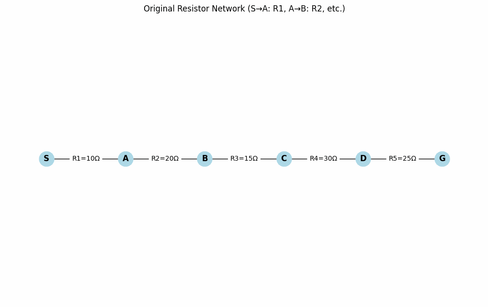

# Problem 1

## 1. Series and Parallel Circuits: Resistors and Capacitors
### 1.1 Resistors

Series: Resistors are connected end-to-end, forming a single current path. The equivalent resistance is:
<math xmlns="http://www.w3.org/1998/Math/MathML"><semantics><mrow><msub><mi>R</mi><mtext>eq</mtext></msub><mo>=</mo><msub><mi>R</mi><mn>1</mn></msub><mo>+</mo><msub><mi>R</mi><mn>2</mn></msub><mo>+</mo><mo>⋯</mo><mo>+</mo><msub><mi>R</mi><mi>n</mi></msub></mrow><annotation encoding="application/x-tex">  R_{\text{eq}} = R_1 + R_2 + \dots + R_n  </annotation></semantics></math>
Parallel: Resistors share the same nodes, providing multiple current paths. The equivalent resistance is:
<math xmlns="http://www.w3.org/1998/Math/MathML"><semantics><mrow><mfrac><mn>1</mn><msub><mi>R</mi><mtext>eq</mtext></msub></mfrac><mo>=</mo><mfrac><mn>1</mn><msub><mi>R</mi><mn>1</mn></msub></mfrac><mo>+</mo><mfrac><mn>1</mn><msub><mi>R</mi><mn>2</mn></msub></mfrac><mo>+</mo><mo>⋯</mo><mo>+</mo><mfrac><mn>1</mn><msub><mi>R</mi><mi>n</mi></msub></mfrac></mrow><annotation encoding="application/x-tex">  \frac{1}{R_{\text{eq}}} = \frac{1}{R_1} + \frac{1}{R_2} + \dots + \frac{1}{R_n}  </annotation></semantics></math>

### 1.2 Capacitors

Series: Capacitors share the same charge, reducing effective capacitance:
<math xmlns="http://www.w3.org/1998/Math/MathML"><semantics><mrow><mfrac><mn>1</mn><msub><mi>C</mi><mtext>eq</mtext></msub></mfrac><mo>=</mo><mfrac><mn>1</mn><msub><mi>C</mi><mn>1</mn></msub></mfrac><mo>+</mo><mfrac><mn>1</mn><msub><mi>C</mi><mn>2</mn></msub></mfrac><mo>+</mo><mo>⋯</mo><mo>+</mo><mfrac><mn>1</mn><msub><mi>C</mi><mi>n</mi></msub></mfrac></mrow><annotation encoding="application/x-tex">  \frac{1}{C_{\text{eq}}} = \frac{1}{C_1} + \frac{1}{C_2} + \dots + \frac{1}{C_n}  </annotation></semantics></math>
Parallel: Capacitors share the same voltage, adding capacitances:
<math xmlns="http://www.w3.org/1998/Math/MathML"><semantics><mrow><msub><mi>C</mi><mtext>eq</mtext></msub><mo>=</mo><msub><mi>C</mi><mn>1</mn></msub><mo>+</mo><msub><mi>C</mi><mn>2</mn></msub><mo>+</mo><mo>⋯</mo><mo>+</mo><msub><mi>C</mi><mi>n</mi></msub></mrow><annotation encoding="application/x-tex">  C_{\text{eq}} = C_1 + C_2 + \dots + C_n  </annotation></semantics></math>

### 1.3 Simplifying Complex Circuits
Consider a circuit with resistors $R_1 = 10 , \Omega$ and $R_2 = 20 , \Omega$ in parallel, in series with $R_3 = 15 , \Omega$, and another parallel branch with $R_4 = 30 , \Omega$ and $R_5 = 60 , \Omega$.

Parallel branch ($R_1$, $R_2$):
<math xmlns="http://www.w3.org/1998/Math/MathML"><semantics><mrow><mfrac><mn>1</mn><msub><mi>R</mi><mn>12</mn></msub></mfrac><mo>=</mo><mfrac><mn>1</mn><mn>10</mn></mfrac><mo>+</mo><mfrac><mn>1</mn><mn>20</mn></mfrac><mo>=</mo><mfrac><mn>3</mn><mn>20</mn></mfrac><mtext>  </mtext><mo>⟹</mo><mtext>  </mtext><msub><mi>R</mi><mn>12</mn></msub><mo>=</mo><mfrac><mn>20</mn><mn>3</mn></mfrac><mo>≈</mo><mn>6.67</mn><mtext> </mtext><mi mathvariant="normal">Ω</mi></mrow><annotation encoding="application/x-tex">  \frac{1}{R_{12}} = \frac{1}{10} + \frac{1}{20} = \frac{3}{20} \implies R_{12} = \frac{20}{3} \approx 6.67 \, \Omega  </annotation></semantics></math>
Series with $R_3$:
<math xmlns="http://www.w3.org/1998/Math/MathML"><semantics><mrow><msub><mi>R</mi><mn>123</mn></msub><mo>=</mo><mn>6.67</mn><mo>+</mo><mn>15</mn><mo>=</mo><mn>21.67</mn><mtext> </mtext><mi mathvariant="normal">Ω</mi></mrow><annotation encoding="application/x-tex">  R_{123} = 6.67 + 15 = 21.67 \, \Omega  </annotation></semantics></math>
Parallel branch ($R_4$, $R_5$):
<math xmlns="http://www.w3.org/1998/Math/MathML"><semantics><mrow><mfrac><mn>1</mn><msub><mi>R</mi><mn>45</mn></msub></mfrac><mo>=</mo><mfrac><mn>1</mn><mn>30</mn></mfrac><mo>+</mo><mfrac><mn>1</mn><mn>60</mn></mfrac><mo>=</mo><mfrac><mn>3</mn><mn>60</mn></mfrac><mo>=</mo><mfrac><mn>1</mn><mn>20</mn></mfrac><mtext>  </mtext><mo>⟹</mo><mtext>  </mtext><msub><mi>R</mi><mn>45</mn></msub><mo>=</mo><mn>20</mn><mtext> </mtext><mi mathvariant="normal">Ω</mi></mrow><annotation encoding="application/x-tex">  \frac{1}{R_{45}} = \frac{1}{30} + \frac{1}{60} = \frac{3}{60} = \frac{1}{20} \implies R_{45} = 20 \, \Omega  </annotation></semantics></math>
Combine $R_{123}$ and $R_{45}$ in parallel:
<math xmlns="http://www.w3.org/1998/Math/MathML"><semantics><mrow><mfrac><mn>1</mn><msub><mi>R</mi><mtext>eq</mtext></msub></mfrac><mo>=</mo><mfrac><mn>1</mn><mn>21.67</mn></mfrac><mo>+</mo><mfrac><mn>1</mn><mn>20</mn></mfrac><mo>≈</mo><mn>0.0461</mn><mo>+</mo><mn>0.05</mn><mo>=</mo><mn>0.0961</mn><mtext>  </mtext><mo>⟹</mo><mtext>  </mtext><msub><mi>R</mi><mtext>eq</mtext></msub><mo>≈</mo><mn>10.41</mn><mtext> </mtext><mi mathvariant="normal">Ω</mi></mrow><annotation encoding="application/x-tex">  \frac{1}{R_{\text{eq}}} = \frac{1}{21.67} + \frac{1}{20} \approx 0.0461 + 0.05 = 0.0961 \implies R_{\text{eq}} \approx 10.41 \, \Omega  </annotation></semantics></math>

For capacitors, e.g., $C_1 = 10 , \mu\text{F}$ and $C_2 = 20 , \mu\text{F}$ in series:
<math xmlns="http://www.w3.org/1998/Math/MathML"><semantics><mrow><mfrac><mn>1</mn><msub><mi>C</mi><mtext>eq</mtext></msub></mfrac><mo>=</mo><mfrac><mn>1</mn><mn>10</mn></mfrac><mo>+</mo><mfrac><mn>1</mn><mn>20</mn></mfrac><mo>=</mo><mfrac><mn>3</mn><mn>20</mn></mfrac><mtext>  </mtext><mo>⟹</mo><mtext>  </mtext><msub><mi>C</mi><mtext>eq</mtext></msub><mo>=</mo><mfrac><mn>20</mn><mn>3</mn></mfrac><mo>≈</mo><mn>6.67</mn><mtext> </mtext><mi>μ</mi><mtext>F</mtext></mrow><annotation encoding="application/x-tex">  \frac{1}{C_{\text{eq}}} = \frac{1}{10} + \frac{1}{20} = \frac{3}{20} \implies C_{\text{eq}} = \frac{20}{3} \approx 6.67 \, \mu\text{F}  </annotation></semantics></math>

### 1.4 Algorithm for Equivalent Resistance/Capacitance

Identify topology: Group components into series or parallel combinations.
Apply formulas:

Resistors: Series ($R_1 + R_2$), Parallel ($1/R_{\text{eq}} = 1/R_1 + 1/R_2$).
Capacitors: Series ($1/C_{\text{eq}} = 1/C_1 + 1/C_2$), Parallel ($C_1 + C_2$).

### Simulation of Equivalent Resistance(series)

### Simulation of Equivalent Resistance(Parallel)

.gif>)

Iterate: Replace each combination with its equivalent until a single value remains.
Advanced cases: Use nodal/mesh analysis or software (e.g., SPICE) for complex circuits.
Circuit Simplification ExamplemarkdownPokaż inline

## 2. Kirchhoff’s Laws

### 2.1 Kirchhoff’s Current Law (KCL)

KCL states that the total current entering a junction equals the total current leaving it:
<math xmlns="http://www.w3.org/1998/Math/MathML"><semantics><mrow><mo>∑</mo><msub><mi>I</mi><mtext>in</mtext></msub><mo>=</mo><mo>∑</mo><msub><mi>I</mi><mtext>out</mtext></msub></mrow><annotation encoding="application/x-tex">  \sum I_{\text{in}} = \sum I_{\text{out}}  </annotation></semantics></math>

### 2.2 Kirchhoff’s Voltage Law (KVL)

KVL states that the sum of voltage drops around a closed loop is zero:
<math xmlns="http://www.w3.org/1998/Math/MathML"><semantics><mrow><mo>∑</mo><msub><mi>V</mi><mi>i</mi></msub><mo>=</mo><mn>0</mn></mrow><annotation encoding="application/x-tex">  \sum V_i = 0  </annotation></semantics></math>

### 2.3 Example Circuit Analysis

Consider a circuit with:

Loop 1: 12 V battery, $R_1 = 4 , \Omega$, $R_2 = 6 , \Omega$ (shared).
Loop 2: $R_2 = 6 , \Omega$, $R_3 = 8 , \Omega$, 6 V battery.
Junction: Currents $I_1$ (Loop 1), $I_2$ (Loop 2), $I_3$ (through $R_3$).

Equations:

KCL: $I_1 = I_2 + I_3$
KVL Loop 1: $12 - 4I_1 - 6I_2 = 0 \implies 12 = 4I_1 + 6I_2$
KVL Loop 2: $-6I_2 - 8I_3 + 6 = 0 \implies 6 = 6I_2 + 8I_3$

Solution:

From KCL: $I_3 = I_1 - I_2$
Loop 2: $6 = 6I_2 + 8(I_1 - I_2) \implies 3 = 4I_1 - I_2$
Loop 1: $12 = 4I_1 + 6I_2 \implies 2 = \frac{2}{3}I_1 + I_2$
Solve:

$I_2 = 2 - \frac{2}{3}I_1$
$3 = 4I_1 - (2 - \frac{2}{3}I_1) \implies 5 = \frac{14}{3}I_1 \implies I_1 \approx 1.07 , \text{A}$
$I_2 \approx 1.29 , \text{A}$, $I_3 \approx -0.22 , \text{A}$

Kirchhoff’s Laws Circuit SolutionmarkdownPokaż inline
## 3. Time Evolution in RL, RC, and RLC Circuits
### 3.1 RC Circuit
For a DC source, capacitor voltage is:
<math xmlns="http://www.w3.org/1998/Math/MathML"><semantics><mrow><msub><mi>V</mi><mi>C</mi></msub><mo stretchy="false">(</mo><mi>t</mi><mo stretchy="false">)</mo><mo>=</mo><msub><mi>V</mi><mn>0</mn></msub><mo stretchy="false">(</mo><mn>1</mn><mo>−</mo><msup><mi>e</mi><mrow><mo>−</mo><mi>t</mi><mi mathvariant="normal">/</mi><mi>R</mi><mi>C</mi></mrow></msup><mo stretchy="false">)</mo></mrow><annotation encoding="application/x-tex">  V_C(t) = V_0 (1 - e^{-t / RC})  </annotation></semantics></math>
Current: $I(t) = \frac{V_0}{R} e^{-t / RC}$, where $\tau = RC$.

### 3.2 RL Circuit

Current: $I(t) = \frac{V_0}{R} (1 - e^{-t / (L/R)})$
Inductor voltage: $V_L(t) = V_0 e^{-t / (L/R)}$, where $\tau = L/R$.

### 3.3 RLC Circuit

Differential equation:
<math xmlns="http://www.w3.org/1998/Math/MathML"><semantics><mrow><mi>L</mi><mfrac><mrow><msup><mi>d</mi><mn>2</mn></msup><mi>I</mi></mrow><mrow><mi>d</mi><msup><mi>t</mi><mn>2</mn></msup></mrow></mfrac><mo>+</mo><mi>R</mi><mfrac><mrow><mi>d</mi><mi>I</mi></mrow><mrow><mi>d</mi><mi>t</mi></mrow></mfrac><mo>+</mo><mfrac><mn>1</mn><mi>C</mi></mfrac><mi>I</mi><mo>=</mo><mn>0</mn></mrow><annotation encoding="application/x-tex">  L \frac{d^2 I}{dt^2} + R \frac{dI}{dt} + \frac{1}{C} I = 0  </annotation></semantics></math>
Solutions:

Underdamped: $I(t) = e^{-\alpha t} (A \cos(\omega_d t) + B \sin(\omega_d t))$, $\alpha = R/(2L)$, $\omega_d = \sqrt{\frac{1}{LC} - \alpha^2}$.
Critically damped: Fastest non-oscillatory decay.
Overdamped: Slow decay.

## 4. Ohm’s Law

Ohm’s Law: $V = IR$. Voltage is proportional to current for a fixed resistance. Applied to each component in complex circuits after simplification.

## 5. Capacitors and Inductors

### 5.1 Capacitors
Store charge: $Q = CV$, current: $I = C \frac{dV}{dt}$.

Series: $1/C_{\text{eq}} = \sum 1/C_i$
Parallel: $C_{\text{eq}} = \sum C_i$

### 5.2 Inductors
Store energy in magnetic field: $V = L \frac{dI}{dt}$.

Series: $L_{\text{eq}} = \sum L_i$
Parallel: $1/L_{\text{eq}} = \sum 1/L_i$

Applications: Capacitors in filters, inductors in transformers.

## 6. AC vs. DC Circuits

### 6.1 Definitions

DC: Constant voltage/current.
AC: Sinusoidal, $V(t) = V_p \sin(\omega t)$.

### 6.2 RMS Values

RMS voltage: $V_{\text{rms}} = \frac{V_p}{\sqrt{2}}$
RMS current: $I_{\text{rms}} = \frac{I_p}{\sqrt{2}}$. Power: $P = V_{\text{rms}} I_{\text{rms}} \cos\phi$.

## 7. PN Junction

A PN junction forms between p-type and n-type semiconductors. The depletion zone arises from carrier recombination, creating a barrier that controls current flow (forward bias allows, reverse bias blocks).

## 8. Diodes and Transistors

### 8.1 Diodes

Allow current in one direction, used in rectification.

### 8.2 Transistors

NPN: Current flows from emitter to collector when base-emitter is forward-biased.
PNP: Opposite polarity. Used in amplification/switching.

## 9. Impedance
Impedance $Z$:

Resistive: $Z_R = R$
Capacitive: $Z_C = \frac{1}{j \omega C}$
Inductive: $Z_L = j \omega L$
Series: $Z_{\text{eq}} = Z_1 + Z_2$
Parallel: $1/Z_{\text{eq}} = 1/Z_1 + 1/Z_2$

## 10. Resonance in RLC Circuits
Resonance occurs when $X_L = X_C$:
<math xmlns="http://www.w3.org/1998/Math/MathML"><semantics><mrow><msub><mi>ω</mi><mn>0</mn></msub><mo>=</mo><mfrac><mn>1</mn><msqrt><mrow><mi>L</mi><mi>C</mi></mrow></msqrt></mfrac></mrow><annotation encoding="application/x-tex">  \omega_0 = \frac{1}{\sqrt{LC}}  </annotation></semantics></math>
Impedance is resistive, maximizing current. Used in tuners/filters.