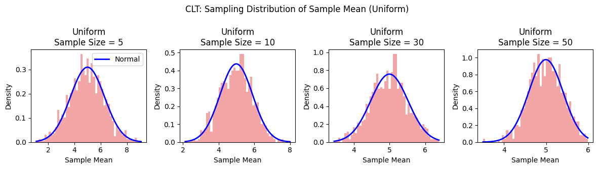
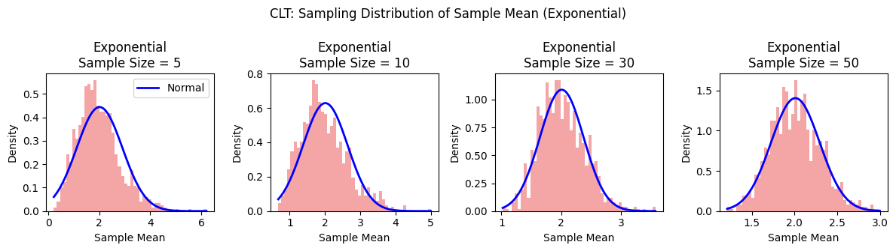
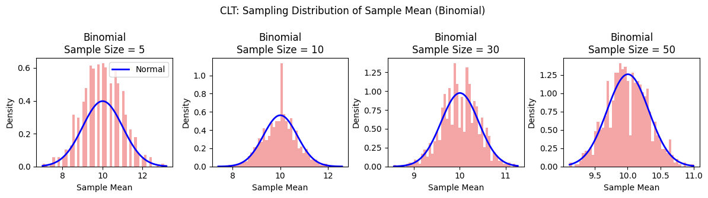

# Problem 1
## Exploring the Central Limit Theorem
The Central Limit Theorem (CLT) is a cornerstone of statistics, stating that the sampling distribution of the sample mean approaches a normal distribution as the sample size $n$ increases, regardless of the population's underlying distribution. Mathematically, for a population with mean $\mu$ and variance $\sigma^2$, the sampling distribution of the sample mean $\bar{x}$ is approximately normal with mean $\mu$ and variance $\frac{\sigma^2}{n}$ for sufficiently large $n$.
In this note, we explore the CLT through simulations using uniform, exponential, and binomial distributions to demonstrate how the sampling distribution of the sample mean behaves.
The normal distribution is a special case where the population is already normally distributed, but the CLT's power lies in its applicability to any distribution, making it invaluable in statistical inference.

### Common Distributions in Real-World Applications

Uniform: Computer-generated random numbers for simulations (e.g., Monte Carlo methods).

Exponential: Lifespan of electronic components before failure.

Binomial: Number of defective items in a batch of products during quality inspection.

Normal: Blood pressure readings in a healthy population.

Poisson: Number of cars passing through a toll booth in an hour.

Geometric: Number of attempts to open a combination lock until success.

Negative Binomial: Number of soccer games played until a team scores 3 goals.

Log-normal: Time to complete complex tasks (e.g., software development projects).

### Definitions with Examples

#### Population
Definition: The entire group of individuals or instances about which conclusions are drawn.

#### Sample
Definition: A subset of the population selected for analysis, as studying the entire population is often infeasible.

#### Sample Size
Definition: The number of observations in a sample.

#### Sampling Distribution
Definition: The probability distribution of a statistic (e.g., sample mean) obtained from repeated samples of the same population.

#### Sample Mean
Definition: The average of a sample, used to estimate the population mean.

### Advanced Concepts

#### Convergence to Normality
Definition: As sample size $n$ increases, the sampling distribution of the sample mean $\bar{x}$ approaches a normal distribution, regardless of the population’s distribution.

#### Skewness
Definition: A measure of a distribution’s asymmetry around its mean.

#### Kurtosis
Definition: A measure of a distribution’s "tailedness" compared to a normal distribution.

#### Variance
Definition: A measure of data spread from the mean.

#### Standard Deviation
Definition: The square root of variance, measuring spread in the same units as the data.

#### Normal Distribution
Definition: A symmetric, bell-shaped probability distribution defined by mean $\mu$ and standard deviation $\sigma$.

##  Sampling and Visualization

## Parameter Exploration

### Skewness/Kurtosis Impact
Uniform: Low skewness (symmetric) and low kurtosis (light tails) allow rapid convergence to normality, evident as the sampling distribution closely matches the normal curve even at $n=5$.

Exponential: High skewness (right-skewed) and moderate kurtosis slow convergence, with noticeable normality emerging only at $n=30$ or higher.

Binomial: Moderate skewness (depending on parameters) and kurtosis lead to gradual convergence, with a clear normal shape by $n=50$.

### Variance Impact
Across all distributions, the spread of the sampling distribution decreases as sample size $n$ increases, consistent with the variance $\frac{\sigma^2}{n}$.
Uniform shows a narrower spread early (e.g., $n=5$), reflecting lower initial variance.

Exponential and Binomial exhibit wider spreads at small $n$ due to higher variance, which narrows significantly by $n=50$.

### Observations

Uniform Distribution: As seen in the CLT sampling distribution graphs for the uniform distribution, its symmetry (low skewness and kurtosis) allows the sampling distribution to closely resemble a normal curve even at a small sample size of $n=10$, as shown in the plot.
Exponential Distribution: The graphs highlight the exponential distribution's high skewness and moderate kurtosis, necessitating larger sample sizes ($n \geq 30$) for the sampling distribution to approximate normality, with noticeable improvement visible from $n=30$ onward.
Binomial Distribution: Reflected in the binomial distribution plots, its discrete and bounded nature leads to a gradual convergence to normality, displaying central tendency that becomes more pronounced by $n=50$.
Variance Impact: The graphs across all distributions demonstrate that higher population variance $\sigma^2$ results in wider sampling distributions at smaller $n$ (e.g., exponential at $n=5$), with the standard error decreasing as $\frac{\sigma}{\sqrt{n}}$ as sample size increases, aligning with CLT principles.
Convergence Insight: The progression across the uniform, exponential, and binomial distribution plots confirms the CLT, showing that sample mean distributions approach normality as $n$ increases, evident from the tightening fit to the normal curve from $n=5$ to $n=50$.

### Real-World Implications of Exploring the Central Limit Theorem

Polling: The CLT enables accurate estimation of national opinions or voter preferences from small, random samples (e.g., 1,000 respondents).

Manufacturing: In quality control, sample averages from production batches  can detect process drift, ensuring products stay within tolerance, leveraging the CLT's convergence to normality.

Finance: Risk and return models rely on the CLT to assume normality in aggregated data, allowing reliable predictions from sample means despite skewed individual data.

Healthcare: Estimating average patient recovery times or drug efficacy from clinical trial samples (e.g., binomial or exponential distributions) benefits from the CLT, enabling valid inferences as sample sizes grow.

Market Research: The CLT supports drawing conclusions about consumer behavior from survey samples, with the variance impact (narrowing at larger $n$) ensuring precision in mean estimates.

