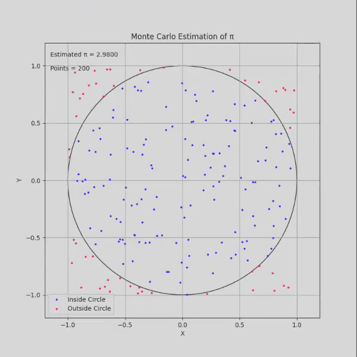
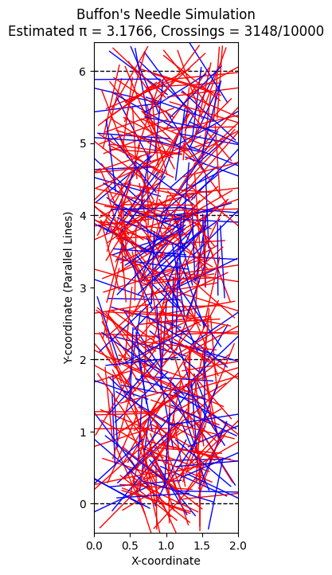

# Problem 2

## Estimating Pi using Monte Carlo Methods

### Theoretical Foundation

Explanation: The ratio of points inside a circle to the total number of points in a square can be used to estimate $\pi$. For a unit circle inscribed in a unit square, the area of the circle is $\pi r^2$ where $r = 1$, so the area is $\pi$. The area of the square is $1 \times 1 = 1$. The ratio of the circle's area to the square's area is $\pi / 1 = \pi$. By generating random points and counting those that fall inside the circle, this ratio can approximate $\pi$.
Derivation: For a unit circle, the formula is $\pi \approx 4 \cdot (\text{points inside the circle} / \text{total points})$. This arises because the circle occupies a quarter of the square's area in the first quadrant, and the factor of 4 adjusts for the full circle.

### Simulation

### Analysis

Accuracy Improvement: The accuracy of the estimate improves as the number of points increases. With more points, the ratio better approximates the true area ratio, reducing statistical error.
Convergence and Computational Considerations: The convergence rate is proportional to $1/\sqrt{N}$, where $N$ is the number of points, indicating a slow but steady improvement. Computationally, this method is efficient for large $N$ but requires sufficient random number quality to avoid bias.

## Buffon's Needle Problem

### Theoretical Foundation

Buffon's Needle problem estimates $\pi$ based on the probability of a needle crossing parallel lines on a plane. A needle of length $l$ is dropped on a plane with parallel lines spaced $d$ apart (where $l \leq d$). The probability of crossing a line depends on the angle and position.
Derivation: The formula is $\pi \approx (2 \cdot \text{needle length} \cdot \text{number of throws}) / (\text{distance between lines} \cdot \text{number of crossings})$.

### Vizualization

### Analysis

Accuracy Effect: The number of needle drops affects the estimate's accuracy. More drops reduce variance and improve the estimate.
Convergence Comparison: This method's convergence rate is also approximately $1/\sqrt{N}$, similar to the circle-based approach, but it may require careful handling of angle distributions for accuracy.

