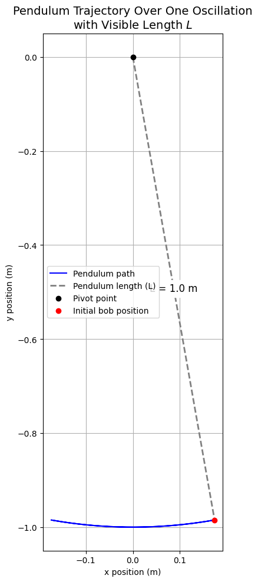

# Problem 1

Measuring Earth's Gravitational Acceleration with a Pendulum
Motivation
The acceleration due to gravity, $g$, is a fundamental constant critical for physics, engineering, and geosciences. A simple pendulum, with its period dependent on $g$, offers a classical method to measure this constant. This experiment emphasizes precise measurement and uncertainty analysis.
Objective
Measure $g$ using a simple pendulum and analyze measurement uncertainties in detail.
Theoretical Background
For small-angle oscillations ($<15^\circ$), the period $T$ of a pendulum of length $L$ is:
$$T = 2\pi \sqrt{\frac{L}{g}}$$
Solving for $g$:
$$g = \frac{4\pi^2 L}{T^2}$$
Experimental Procedure
### Materials

String (1.0 m long)

Small weight (e.g., bag of coins)

Stopwatch

Ruler (resolution: 1 mm)

### Setup

Attach the weight to the string, securing the other end to a fixed support.
Measure $L = 1.00 , \text{m}$ from the suspension point to the weight’s center. Uncertainty: $\delta L = \frac{0.001}{2} = 0.0005 , \text{m}$.

Data Collection

Displace the pendulum slightly ($<15^\circ$) and release.
Measure the time for 10 oscillations ($T_{10}$) 10 times.
Calculate the mean $\overline{T_{10}}$, standard deviation $s$, and period $T = \frac{\overline{T_{10}}}{10}$.

Input Data

$L = 1.00 , \text{m}$
Times for 10 oscillations (s): 19.93, 19.65, 19.70, 20.93, 20.89, 20.89, 20.96, 20.90, 20.81, 20.86

Calculations

Mean time for 10 oscillations:
$$\overline{T_{10}} = \frac{205.52}{10} = 20.552 \, \text{s}$$

Period:
$$T = \frac{20.552}{10} = 2.0552 \, \text{s}$$

Standard deviation:
$$s = \sqrt{\frac{1}{9} \sum (T_i - 20.552)^2} \approx 0.4083 \, \text{s}$$

Uncertainty in $\overline{T_{10}}$:
$$u_{\overline{T_{10}}} = \frac{0.4083}{\sqrt{10}} \approx 0.1292 \, \text{s}$$

Uncertainty in $T$:
$$u_T = \frac{0.1292}{10} = 0.01292 \, \text{s}$$

Calculation of $g$:
$$g = \frac{4 \pi^2 \cdot 1.00}{(2.0552)^2} \approx \frac{39.478}{4.224} \approx 9.36 \, \text{m/s}^2$$

Uncertainty in $g$:
Relative uncertainty:
$$\frac{\delta g}{g} = \sqrt{\left( \frac{\delta L}{L} \right)^2 + \left( \frac{2 \delta T}{T} \right)^2} = \sqrt{\left( \frac{0.0005}{1.00} \right)^2 + \left( \frac{2 \cdot 0.01292}{2.0552} \right)^2} \approx 0.01258$$
Absolute uncertainty:
$$\delta g = 9.36 \cdot 0.01258 \approx 0.12 \, \text{m/s}^2$$

### Results
The measured gravitational acceleration is:
$$g = 9.36 \pm 0.12 \, \text{m/s}^2$$

### Comparison:
 The result is slightly below the standard $g \approx 9.81 , \text{m/s}^2$, possibly due to air resistance or pivot friction.
 
### Conclusion
Using a pendulum of length $L = 1.00 , \text{m}$, we measured $g = 9.36 \pm 0.12 , \text{m/s}^2$. The experiment underscores the importance of uncertainty analysis and precise measurements in determining physical constants.